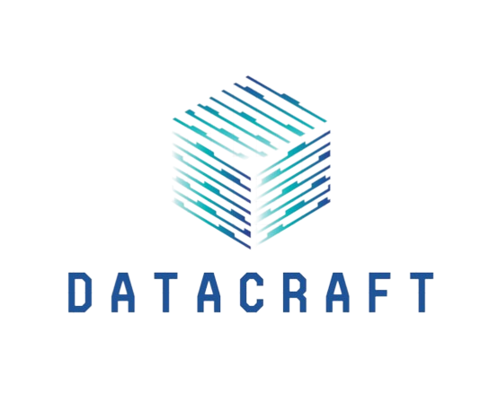
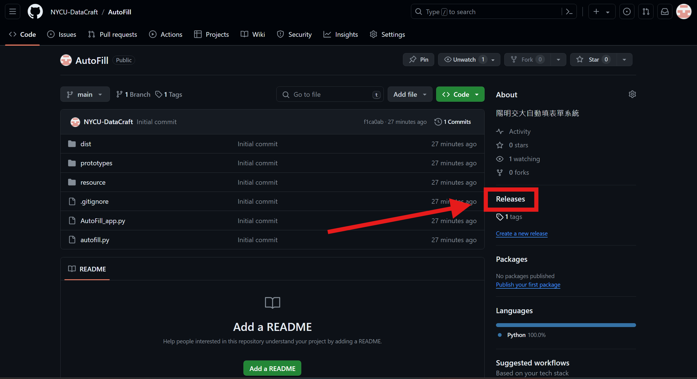
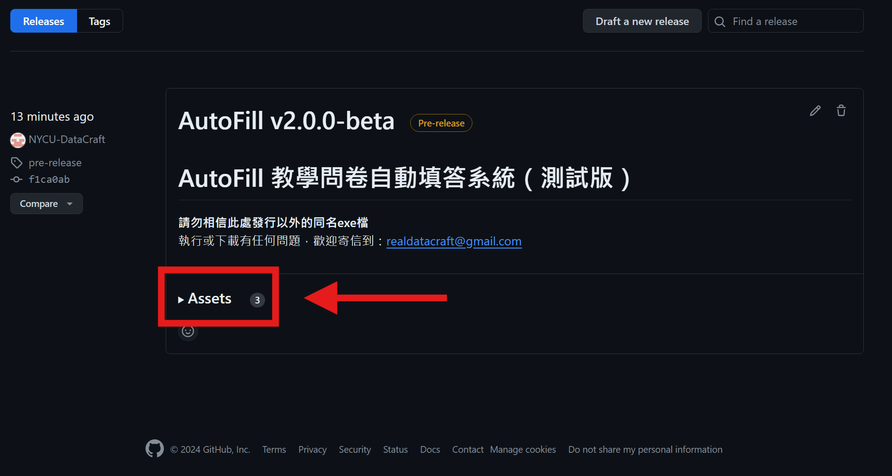
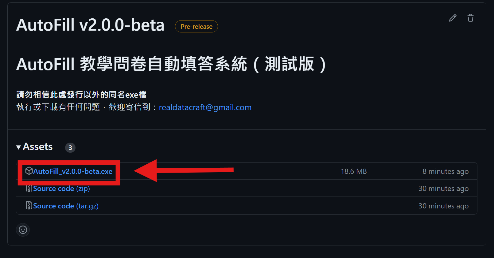

  
  <h3 align="center">AutoFill - 自動化教學表單填寫</h3>
  <h5 align="center">以下內容包含：如何下載、常見Q&A</h3>

## 如何下載

  <code style="color:Red">請先確認電腦上有安裝Google Chrome！！！！！</code>.
  <h4> 1. 點開主頁面右方的Releases </h4> 
  
   
  <h4> 2. 選擇最新版本，點擊Assets展開 </h4> 
  
   
  <h4> 3. 直接點擊exe檔下載 </h4> 
  

## Q&A
##### Q：若防毒軟件或系統阻止運行怎麼辦？
A：由於目前只在一部分Windows系統上測試過，請先允許強制執行。

##### Q：瀏覽器不讓我下載怎麼辦？
A：可以試試看更換瀏覽器，目前測試Chrome沒問題，Edge會有警告（應該能強制執行）

##### Q：如果我想挑某些課手動填答怎麼辦？
A：你可以先自行手動填答你想要填的問卷，之後再執行自動填答系統。

##### Q：填答的內容是什麼？
A：目前沒有能調整填答內容的功能，會填的項目：非常滿意、認真、從不缺課、3-5小時、前1/3、適中

##### Q：如果程式暫停太久（超過30秒）怎麼辦？
A：除二階段驗證提供的30秒暫停，若出現這種情況，可以直接關閉瀏覽器，再重新執行。

##### Q：仿人模式是什麼？是否可以將其關閉？
A：仿人模式會在填答的過程中加入一些延遲以模擬真人操作，若關閉可以讓填問卷的速度大幅提升，但目前不確定學校系統是否有防機器測試。

##### Q：這個軟體是病毒嗎？會儲存或使用我的個人資料嗎？
A：不是，這個軟體不會以任何形式儲存或使用你的個人資料。
